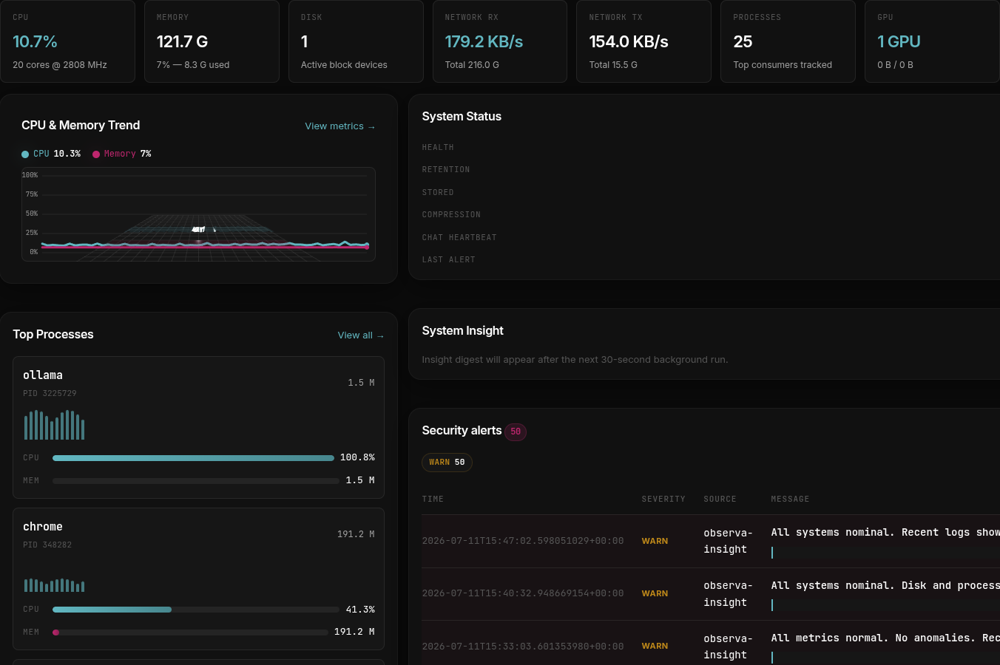

# Observa

A real-time system observability dashboard in Rust. It collects system metrics,
ingests logs, persists time-series data in SQLite, caches recent events in Redis,
and streams live updates to a dark, terminal-inspired web UI via Server-Sent
Events. An OpenAI-compatible LLM endpoint powers context-aware chat and anomaly
analysis.

> **Experimental — not production-ready.** Observa is an active work in
> progress. APIs, storage schemas, configuration options, and UI behavior may
> change without notice. It is intended for personal homelab monitoring,
> development, and experimentation rather than critical production
> infrastructure.



## Features

- **Live metrics** — CPU, memory, disks, networks, and top processes sampled
  from `sysinfo`.
- **Log ingestor** — reads `journalctl` when available, or tails a fallback log
  file.
- **Persistent storage** — SQLite for metric history, logs, and chat sessions.
- **Optional Redis cache** — speeds up recent metric/log lookups; the server
  degrades gracefully if Redis is unavailable.
- **SSE event bus** — `/events` streams `Metric`, `Log`, and `Chat` events to
  the browser.
- **LLM assistant** — `POST /api/chat/ask` and `GET /api/chat/stream` inject
  recent metrics and logs into the prompt context.
- **Progressive UI** — server-rendered Tera templates with HTMX; JavaScript
  enhances live updates and the chart fallback when enabled.

## Quick start

```bash
# Build the whole workspace
cargo build --workspace

# Run the dashboard with defaults (no SQLite, no Redis, no LLM key)
cargo run -p observa-cli

# Open http://127.0.0.1:3000
```

## Configuration

`observa.toml` in the workspace root provides defaults. Every value can be
overridden with environment variables (`OBSERVA_*`) or CLI flags.

```toml
bind_addr = "127.0.0.1:3000"
llm_api_base = "http://localhost:8080/v1"
llm_model = "llama"
sample_interval_ms = 2000
log_source = "journald"
log_tail = true
```

| Variable | Env / CLI | Description |
|---|---|---|
| `database_url` | `--database-url` / `OBSERVA_DATABASE_URL` | Optional SQLite URL, e.g. `sqlite://observa.db` |
| `redis_url`    | `--redis-url` / `OBSERVA_REDIS_URL`       | Optional Redis URL, e.g. `redis://127.0.0.1:6379` |
| `llm_api_base` | `--llm-api-base` / `OBSERVA_LLM_API_BASE` | OpenAI-compatible root, e.g. `https://api.openai.com/v1` or `http://localhost:8080/v1` |
| `llm_api_key`  | `--llm-api-key` / `OBSERVA_LLM_API_KEY`  | Bearer token for the LLM endpoint; leave unset to use the built-in fallback responder |
| `log_source`   | `--log-source` / `OBSERVA_LOG_SOURCE`    | `journald` or `file` |
| `log_file`     | `--log-file` / `OBSERVA_LOG_FILE`        | Required when `log_source = "file"` |

## Docker

A multi-stage Dockerfile and Compose stack are included. The image is built from
`cgr.dev/chainguard/rust:latest-dev` and runs on `cgr.dev/chainguard/wolfi-base`.
`cargo-chef` is used in the builder stage so dependency layers are cached.

```bash
# Build and start Observa + a local llama-server sidecar
docker compose up --build

# Open http://localhost:3000
```

The Compose file bakes `templates/` and `assets/` into the image for a
consistent runtime, persists SQLite data in a named volume, and expects a GGUF
model at `./models/lowbit-2026/Qwen3-4B-Instruct-2507-Q2_K.gguf` by default.
Place your GGUF files in a `models/` directory next to `docker-compose.yml`, or
change the `llama-server.command` path and `deploy.resources.limits.memory` to
match your model.

### macOS / Docker Desktop

The default Compose stack uses Linux-only host features (`network_mode: host`,
`/proc` bind-mount, `pid: host`, and NVIDIA CDI reservations) to report host
memory, processes, and disks. On macOS, use the dedicated portable stack:

```bash
# Start Observa without host-network / host-proc privileges
docker compose -f docker-compose.macos.yml up --build

# Open http://localhost:3000
```

The macOS variant runs in a more isolated container, so it reports the
container's own memory/process limits rather than the Mac host. Point it at
inference servers on the Mac by setting `OBSERVA_LLM_API_BASE` to
`http://host.docker.internal:<port>/v1`.

### Full host observability on macOS

The Docker Desktop limitation exists because Docker Desktop runs containers
inside a Linux VM that does not expose the Mac's `/proc`, PID namespace, or
network namespace. To see the actual Mac host metrics, run Observa natively:

```bash
# Requires Rust toolchain (https://rustup.rs)
cargo build --release -p observa-cli

# Run with defaults
./target/release/observa

# Or with a local LLM server on the Mac
export OBSERVA_LLM_API_BASE=http://localhost:11434/v1
export OBSERVA_LLM_API_KEY=unused
export OBSERVA_LLM_MODEL=llama
./target/release/observa
```

The Rust binary uses `sysinfo` directly on macOS, so CPU, memory, disks,
processes, and network interfaces reflect the real Mac host.

## Optional Redis

Start a local Redis and export its URL:

```bash
docker run -d --name redis -p 6379:6379 redis:7-alpine
export OBSERVA_REDIS_URL=redis://127.0.0.1:6379
```

## LLM setup

To enable the chat assistant, point the app at any OpenAI-compatible server.
For a local model served by `llama.cpp`:

```bash
export OBSERVA_LLM_API_BASE=http://localhost:8080/v1
export OBSERVA_LLM_API_KEY=unused
export OBSERVA_LLM_MODEL=llama-3-8b
```

## Tests

```bash
# All workspace tests
cargo test --workspace

# Clippy with warnings as errors
cargo clippy --workspace --all-targets -- -D warnings

# Integration test only (spins up server, collector, ingestor, and mock LLM)
cargo test -p observa-server --test integration
```

## Architecture

The workspace is split into small, acyclic crates:

| Crate | Responsibility |
|---|---|
| `observa-shared` | Domain types, errors, events |
| `observa-config` | Configuration, CLI, tracing, shutdown |
| `observa-db` | SQLite persistence and migrations |
| `observa-cache` | Redis wrapper with in-memory fallback |
| `observa-bus` | SSE broadcast bus |
| `observa-collector` | System metrics sampler |
| `observa-ingestor` | Log/journal ingestion |
| `observa-llm` | OpenAI-compatible chat client |
| `observa-server` | HTTP dashboard and API |
| `observa-cli` | Composes all subsystems into a single binary |
